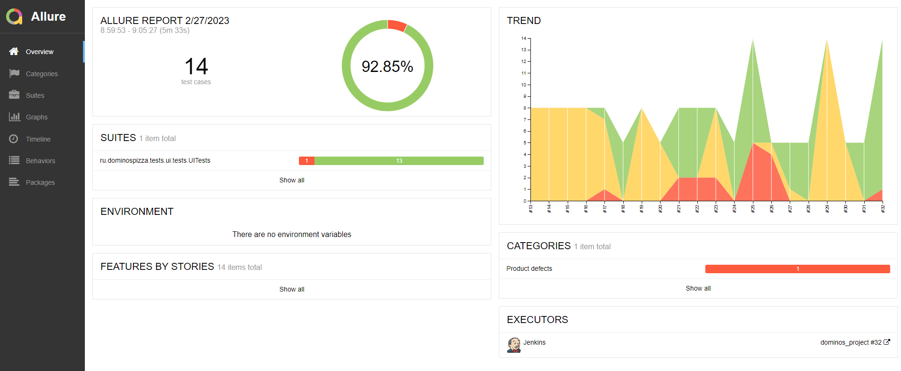

<h1>Дипломный проект по автоматизации тестирования WEB, API, MOBILE платформ
<a href="https://podolsk.dominospizza.ru/">DOMINO'S PIZZA</a></h1>

<div style="display: flex; flex-direction:column;">
<a target="_blank" href="https://podolsk.dominospizza.ru/"></a>
</div>

## :pushpin: Содержание:

<div id="header"></div>

- [Технологии и инструменты](#tech)
- [Запуск из терминала](#term)
- [Возможные комбинации запуска](#combinations)
- [Сборка в Jenkins](#job)
- [Allure отчет](#allure)
- [Интеграция с Allure TestOps](#testOps)
- [Интеграция с Jira](#jira)
- [Отчет в Telegram](#tm)
- [Видео примеры прохождения тестов](#video)

## :rocket: Технологии и инструменты

| Intellij Idea                                                                                                                    | Java         | Github  | JUnit 5  | Gradle | Selenide | Selenoid | Allure | Jenkins | Browserstack                                                                                                                                                                    | Android Studio                                                                                                                         |                                                                                                     Appium |
|:---------------------------------------------------------------------------------------------------------------------------------|-------------| ----- | ----- | ----- | ----- | ----- | ----- | ----- |---------------------------------------------------------------------------------------------------------------------------------------------------------------------------------|----------------------------------------------------------------------------------------------------------------------------------------|-----------------------------------------------------------------------------------------------------------:|
| <a id ="tech" href="https://www.jetbrains.com/idea/"></a> | <a href="https://www.java.com/"></a>| <a href="https://github.com/"></a> | <a href="https://junit.org/junit5/"></a> | <a href="https://gradle.org/"></a> | <a href="https://selenide.org/"></a> | <a href="https://aerokube.com/selenoid/"></a> | <a href="https://github.com/allure-framework/allure2"></a> | <a href="https://www.jenkins.io/"></a>| <a href="https://app-automate.browserstack.com/"></a> | <a href="https://developer.android.com/studio"></a> | <a href="https://appium.io/"></a> |

Автотесты в этом проекте написаны на `Java` с использованием `Selenide`.\
`Gradle` - инструмент автоматизации сборки.  \
`JUnit5` - для выполнения тестов.\
`REST Assured` - для тестирования REST-API сервисов.\
`Jenkins` - CI/CD для запуска тестов удаленно.\
`Selenoid` - для удаленного запуска браузера в `Docker` контейнерах.\
`Browserstack` - для запуска тестов мобильных устройств удаленно.\
`Android Studio tools`, `Appium` - для запуска мобильных тестов локально на эмуляторе мобильных устройств.\
`Allure Report` - для визуализации результатов тестирования.\
`Telegram Bot` - для уведомлений о результатах тестирования.\
`Allure TestOps` - система управления тестированием.

<a href="#header" style="display:block; text-align:center; cursor:pointer; color: #fff !important; text-decoration: none">
&#8679; К содержанию</a>

## :computer: Запуск тестов из терминала

Для запуска тестов локально и в Jenkins используется команда:
<a id="term"></a>

```bash
gradle -Denv=${ENV} clean ${TAG}
```

`tag` - теги для запуска выполнения тестов:
> - *api*
>- *ui*
>- *mobile*

`env` - определяет среду для запуска этих тестов:
> - *api*
>- *ui.remote*
>- *ui.local*
>- *browserstack*
>- *local*

Дополнительные свойства извлекаются из соответствующего файла конфигурации (в зависимости от значения `env`):

```bash
./resources/config/api/${env}.properties
./resources/config/ui/${env}.properties
./resources/config/mobile/${env}.properties
```

<a href="#header" style="display:block; text-align:center; cursor:pointer; color: #fff !important; text-decoration: none">
&#8679; К содержанию</a>

<p id="combinations">Возможные комбинации:</p>


<a href="#header" style="display:block; text-align:center; cursor:pointer; color: #fff !important; text-decoration: none">
&#8679; К содержанию</a>

## <a id="job" name="Запуск в Jenkins">Запуск в [Jenkins](https://jenkins.autotests.cloud/job/dominos_project/)</a>

Главная страница сборки:
<p  align="center">

</p>

Параметризованное задание Jenkins может быть запущено с необходимыми ***tag*** и ***env***:
<p  align="center">

</p>

Конфиденциальная информация (имена для входа и пароли) хранится в закодированном виде в
./resources/config/credentials/credentials.properties.

После завершения сборки результаты тестирования доступны в:
> - <code><strong>*Allure Report*</strong></code>
>- <code><strong>*Allure TestOps*</strong></code> - результаты загружаются туда и тест-кейсы могут автоматически
   обновляться в соответствии с последними изменениями в коде.

<a href="#header" style="display:block; text-align:center; cursor:pointer; color: #fff !important; text-decoration: none">
&#8679; К содержанию</a>

##  Отчет в <a target="_blank" href="https://jenkins.autotests.cloud/job/dominos_project/32/allure/">Allure report</a>

### Основное окно

<div align="center">

</div>

### Тесты

<div align="center">

</div>

### Графики

<div align="center">

</div>
<a href="#header" style="display:block; text-align:center; cursor:pointer; color: #fff !important; text-decoration: none">&#8679; К содержанию</a>

## </a>Интеграция с <a target="_blank" href="https://allure.autotests.cloud/launch/19608">Allure TestOps</a>

### Дашборд

<div align="center">

</div>

### Тест-кейсы

<div align="center">

</div>

<a href="#header" style="display:block; text-align:center; cursor:pointer; color: #fff !important; text-decoration: none">
&#8679; К содержанию</a>

## </a>Интеграция с трекером задач <a target="_blank" href="https://jira.autotests.cloud/browse/HOMEWORK-498">Jira</a>

<div align="center">

</div>

<a href="#header" style="display:block; text-align:center; cursor:pointer; color: #fff !important; text-decoration: none">
&#8679; К содержанию</a>

## </a> Уведомление в Telegram при помощи бота

<div align="center">

</div>

<a href="#header" style="display:block; text-align:center; cursor:pointer; color: #fff !important; text-decoration: none">
&#8679; К содержанию</a>

### </a> Примеры видео о прохождении тестов Selenoid

<div id="video" align="center">
<video src="https://user-images.githubusercontent.com/59203915/221523275-0d24cd32-d37b-43bf-91c3-81ed86881149.mp4"></video>
</div>

### </a> Примеры видео о прохождении тестов Browserstack

<div align="center">
<video src="https://user-images.githubusercontent.com/59203915/221526156-cace06ec-a478-49b9-9011-ce2155ba95f1.mp4"></video>
</div>

<a href="#header" style="display:block; text-align:center; cursor:pointer; color: #fff !important; text-decoration: none">
&#8679; К содержанию</a>